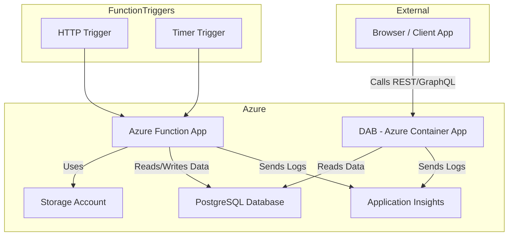

# **Portman Agent - Azure Deployment and Usage Guide** 🚀

### Portman Agent is an Azure-based project that tracks vessel port calls. It consists of the following main components:

#### 1. Infrastructure (Terraform):
- Azure Function App with an HTTP trigger
- PostgreSQL database (Azure Database for PostgreSQL flexible server)
- Network and security rules
- Application Insights monitoring

#### 2. Functionality:
- Fetches data from the Digitraffic port call API (https://meri.digitraffic.fi/api/port-call/v1/port-calls)
- Stores information in two PostgreSQL tables:
    - `voyages`: Contains all port calls (e.g., vessel details, schedules, passengers)
    - `arrivals`: Tracks changes in arrival times

#### 3. Features:
- Can track specific vessels based on IMO number
- Stores information such as:
    - Vessel name and IMO number
    - Estimated and actual arrival and departure times
    - Number of passengers and crew
    - Port and berth details
    - Previous and next port

#### 4. Usage:
- Via HTTP trigger (Function App URL)
- Parameters:
    - `code`: Function App authentication
    - `imo`: Vessels to track (comma-separated IMO numbers)

#### 5. Environments:
- Development
- Testing
- Production
- Separate configurations for each environment

#### 6. CI/CD:
- GitHub Actions workflows for automatic deployment
- Terraform state management in Azure Storage Account
- Automated testing and deployment

#### 7. Security:
- Azure Function App authentication
- PostgreSQL server firewall
- Environment variables for sensitive data

---

This diagram shows the Maritime National Single Window (MNSW) system’s data flows and integration with national authorities and international systems. It connects **Fintraffic Digitraffic**, **Portman**, and **MNSW**, facilitating automated (S2S) and manual data exchanges. The system ensures compliance with **EU Regulation 2019/1239**, streamlining maritime reporting across the EU.  


Portman Agent project scope has been marked with a red box in the diagram.

---

## **📌 Local Deployment Instructions**  

### **📌 Prerequisites**
Before deploying **locally**, ensure you have:

✅ **Terraform Installed**: [Download Terraform](https://developer.hashicorp.com/terraform/downloads)  
✅ **Azure CLI Installed**: [Download Azure CLI](https://learn.microsoft.com/en-us/cli/azure/install-azure-cli)  
✅ **Logged into Azure**:
```bash
az login
```
✅ **Backend Storage for Terraform State** (Azure Storage Account with blob container)

### **1️⃣ Select Environment**  
#### **🔹 Choose Environment (`development`, `testing`, `production`)**  
```bash
cd environments/<environment>
```

### **2️⃣ Define Azure storage for storing Terraform state and Set Up Terraform**  
There are defaults defined (`storage_account_name`, `resource_group_name`, `container_name`) for saving Terraform state in Azure in `backend.tf`. Set these according to your Azure account. Resource group and storage account used for Terraform state better BE DIFFERENT than used in `terraform plan` step.

Then initialize Terraform.
```bash
terraform init -upgrade
```

Or backend variables can also be defined as command-line options:
```bash
terraform init -upgrade \
  -backend-config="resource_group_name=<your_resource_group_name>" \
  -backend-config="storage_account_name=<your_storage_account_name>" \
  -backend-config="container_name=<your_container_name>"
```

🚨 **If you are using Windows, you should also add subscription-id as a command-line variable:**  
```bash
terraform init -upgrade \
  -backend-config="subscription_id=<your_azure_subscription_id>" \
  -backend-config="resource_group_name=<your_resource_group_name>" \
  -backend-config="storage_account_name=<your_storage_account_name>" \
  -backend-config="container_name=<your_container_name>"
```

### **3️⃣ Create Terraform Deployment Plan for Infrastructure**  
The name of the storage account must to be defined separately because of the different Azure naming validations (no dashes allowed in storage account names). 

```bash
terraform plan -var-file=terraform.tfvars \
  -var="naming_prefix=<your_naming_prefix>" \
  -var="storage_account_name=<your_storage_account_name>" \
  -var="resource_group_owner_tag_value=<your_azure_account_email>" \
  -var="admin_password=<your_postgres_admin_password>" -out=main.tfplan
```
🚨 **Use DIFFERENT storage account name than in `terraform init` in previous step**  

### **4️⃣ Deploy Infrastructure**  
```bash
terraform apply main.tfplan
```
✅ **Terraform provisions resources for the selected environment.**  

---

### **📌 Destroy Infrastructure Locally**  
**To safely destroy all resources:**  
```bash
terraform destroy -var-file=terraform.tfvars \
  -var="naming_prefix=<your_naming_prefix>" \
  -var="storage_account_name=<your_storage_account_name>" \
  -var="resource_group_owner_tag_value=<your_azure_account_email>" \
  -var="admin_password=<your_postgres_admin_password>" -auto-approve
```
✅ **Destroys all resources for the selected environment.**  

---

## **📌 Deploy via GitHub Actions**  

### **📌 Prerequisites**
Before deploying via **GitHub Actions**, ensure you have:  
✅ **Azure User-assigned Managed Identity with Federated GitHub Credentials**  
- Detailed instructions in [SiiliHub](https://siilihub.atlassian.net/wiki/spaces/SW/pages/4166254596/Azure+CI+CD+authentication#Usage-with-Github-environment)

✅ **GitHub Actions Secrets/Variables Configured** (For automated deployment)  
✅ **Backend Storage for Terraform State** (Azure Storage Account with blob container)  
- 🚨 **USE DIFFERENT resource group and storage account for storing Terraform state and for deploying your infrastructure!**

### **1️⃣ Set Up GitHub Environment Secrets**  
Go to **GitHub Repository → Settings → Secrets & Variables → Actions** and add/set these for desired environment (`development`, `testing`, `production`):  

| Secret Name | Description |
|------------|-------------|
| **`AZURE_CLIENT_ID`** | Azure Client ID from your User-assigned Managed Identity |
| **`AZURE_TENANT_ID`** | Azure Tenant ID from your User-assigned Managed Identity |
| **`AZURE_SUBSCRIPTION_ID`** | Azure Subscription ID of your Azure account |
| **`BACKEND_RESOURCE_GROUP`** | Resource Group for Terraform Backend |
| **`BACKEND_STORAGE_ACCOUNT`** | Azure Storage Account for Terraform State |
| **`BACKEND_CONTAINER_NAME`** | Azure Blob Container for Terraform State |
| **`DB_HOST`** | PostgreSQL Server Host |
| **`DB_PASSWORD`** | PostgreSQL Admin Password |

| Variable Name | Description |
|------------|-------------|
| **`NAMING_PREFIX`** | Naming prefix for Azure resources |
| **`OWNER_TAG`** | The value of the mandatory 'Owner' tag for created Azure resource group |
| **`STORAGE_ACCOUNT_NAME`** | Name of Azure Storage Account to be created (`NAMING_PREFIX` *can not be used here because there are stricter naming validation rules for Azure storage accounts)* |

✅ **GitHub Actions will securely use these secrets/vars during deployment.**  

---

### **2️⃣ Deploy Infrastructure via GitHub Actions**  
#### **🔹 Automatic Deployment (Pull Request to `main`)**
- **Terraform Deployment workflow is launched**
- **Changes made in Azure infrastructure can be verified from `Terraform Plan` job**
- **Once the Pull Request is merged, the `Terraform Apply` job is automatically launched and changes deployed to Azure**

✅ **GitHub Actions automatically deploys the infrastructure.**  

---

### **3️⃣ Manually Deploy Specific Environments**
#### **🔹 Run Workflow from GitHub Actions UI**  
- **Go to GitHub Actions → Terraform Deployment**  
- **Click "Run Workflow"**  
- **Select Branch (`develop`, `test`, `main`)**  
- **Select Deployment Environment (`development`, `testing`, `production`)**  
- **Click "Run workflow"**  

✅ **Terraform will now deploy the selected environment.**  

---
### **📌 Destroy Infrastructure via GitHub Actions**  
Destroying infrastructure needs manual approval on created GitHub Issue.  

**To destroy resources manually from GitHub Actions:**  
- **Go to GitHub Actions → Terraform Destroy**  
- **Click "Run Workflow"**  
- **Select Branch (`develop`, `test`, `main`)**  
- **Select Deployment Environment (`development`, `testing`, `production`)**  
- **Click "Run workflow"**  
- **Review the plan in GitHub Actions logs** 
- **Go to GitHub issues and select the issue regarding this destroy deployment**  
- **Follow the instructions on issue and either approve or decline the destroyment**  
- **If approved, the "Terraform Apply Destroy" job will be launched automatically**  

✅ **Prevents accidental resource deletion.**  

---

## **📌 Deploy Portman function to Azure Function App via GitHub Actions**  

### **1️⃣ Set Up GitHub Environment Secret/Variables**  

| Secret Name | Description |
|------------|-------------|
| **`DB_HOST`** | PostgreSQL Server Host created in infrastructure deployment |

| Variable Name | Description |
|------------|-------------|
| **`AZURE_FUNCTIONAPP_NAME`** | Name of the Azure Function App service created in infrastructure deployment |
| **`AZURE_RESOURCE_GROUP`** | Resource Group of the Azure resources created in infrastructure deployment |

---

### **2️⃣ Manually Deploy to Specific Environment**  
#### **🔹 Run Workflow from GitHub Actions UI**  
- **Go to GitHub Actions → Deploy Python App to Azure Function App**  
- **Click "Run Workflow"**  
- **Select Branch (`develop`, `test`, `main`)**  
- **Select Deployment Environment (`development`, `testing`, `production`)**  
- **Click "Run workflow"**  

✅ **Terraform will now deploy Portman function to the selected environment.**  

## **📌 Deploy Portman function to Azure Function App locally via Azure Cli**  

**Set the db-credentials as environment variables (if not set yet) for Azure Function App:**  
```
az functionapp config appsettings set \
  --name <your_function_app_name> \
  --resource-group <your_resource_group> \
  --settings \
    "DB_HOST=<your_postgres_db_host>" \
    "DB_NAME=portman" \
    "DB_USER=adminuser" \
    "DB_PASSWORD=<your_postgres_db_password>"
```
**Deploy Python App to Azure Function App via Azure Functions Core Tools:**  
```
func azure functionapp publish <your_function_app_name> --python
```

---

## **📌 Usage**

### **Portman Agent function**
**There are 2 triggers for Portman Agent function:**  
- http_trigger: REST API for function  
- timer_trigger: Scheduled trigger, runs every 15mins  

**The Portman Agent http-function URL can be found from:**  
- Azure Portal -> Function App -> Functions -> http_trigger  
- GitHub Actions Deployment log  

**Invoke the Portman Agent function:**  
- Use the function URL with `code` parameter
- Define trackable vessels (IMO-numbers separated with comma) with `imo` parameter (optional)  
---
### **PostgreSQL Database**
**Query `voayges` and `arrivals` from Azure PortgreSQL Server:**  
- Database (`portman`) and tables (`voayges` and `arrivals`) are automatically created by Portman function if they don't exist
- db-host: Use the endpoint of the deployed Azure PortgreSQL Server as a Postgres DB host, also defined in environment variable `DB_HOST` for Azure Function App service
- db-user: Use `adminuser` as a Postgres DB user
- db-password: Use the value defined in environment variable `DB_PASSWORD` for Azure Function App service or the admin password defined in local deployment process as a Postgres DB password
- db-name: Use `postgres` as a Postgres database name
---
### **REST/Graphql APIs published via DAB**
**Data API Builder (DAB) is deployed as a Azure Container App:**  
- Rest and Graphql APIs with read-operations for both `voayges` and `arrivals` are automatically published by DAB
- Url for DAB/APIs can be copied from Azure Portal -> Container App (DAB) -> Application Url, for example:
  - https://<AZURE_CONTAINER_APP_NAME>.<RANDOM_PART>.<AZURE_LOCATION>.azurecontainerapps.io
- Swagger-UI and Graphql playground available at `/swagger` and `/graphql`
- REST endpoints support the following [OData query parameters](https://learn.microsoft.com/en-us/azure/data-api-builder/rest?WT.mc_id=DT-MVP-5005050#query-parameters) (case sensitive) to control the returned items:
  - $select: returns only the selected columns
  - $filter: filters the returned items
  - $orderby: defines how the returned data is sorted
  - $first and $after: for pagination, returns only the top n items
- REST-api usage example:
```
GET https://<AZURE_CONTAINER_APP_NAME>.<RANDOM_PART>.<AZURE_LOCATION>.azurecontainerapps.io/api/arrivals?$select=portcallid,vesselname,ata&$filter=vesselname eq 'Finnsea'
```
- Graphql usage example (curl):
```
curl -L 'https://<AZURE_CONTAINER_APP_NAME>.<RANDOM_PART>.<AZURE_LOCATION>.azurecontainerapps.io/graphql' \
-H 'Content-Type: application/json' \
-d '{
  "query": "{ arrivals(first: 5) { items { portcallid vesselname ata } endCursor hasNextPage } }"
}'
```
- OpenAPI document available at endpoint `/openapi`
---

## **Running Azure functions locally**  
Azure functions can be runned in local environment using Azure Functions Core Tools.  

- Install [Azure Functions Core Tools](https://learn.microsoft.com/en-us/azure/azure-functions/functions-run-local?tabs=macos%2Cisolated-process%2Cnode-v4%2Cpython-v2%2Chttp-trigger%2Ccontainer-apps&pivots=programming-language-python)  
- Install Python (*currently Azure Functions support Python version < 3.13*)
- Setup a virtual environment (venv):  

```
python3 -m venv .venv
```
```
source .venv/bin/activate  # macOS/Linux
```

```
.venv\Scripts\activate      # Windows
```

Install dependencies:

```
pip install -r requirements.txt
```
- Install local PostgreSQL database  
- Set the right db-credentials by environment variables:  
```
# macOS/Linux:

export DB_NAME="portman_db"
export DB_USER="custom_user"
export DB_PASSWORD="secure_password"
export DB_HOST="192.168.1.100"
export DB_PORT="5432"
```
Or
```
# Windows:

set DB_NAME=portman_db
set DB_USER=custom_user
set DB_PASSWORD=secure_password
set DB_HOST=192.168.1.100
set DB_PORT=5432
```
- Add `local.settings.json` to the project root directory with following content:  

Using Azure Storage Account:
```bash
{
  "IsEncrypted": false,
  "Values": {
    "AzureWebJobsStorage": "<YOUR_AZURE_STORAGE_ACCOUNT_CONNECTION_STRING>",
    "FUNCTIONS_WORKER_RUNTIME": "python"
  }
}
```
**OR** if you want to use local Azure Storage emulator `Azurite`:
```bash
{
  "IsEncrypted": false,
  "Values": {
    "AzureWebJobsStorage": "UseDevelopmentStorage=true",
    "FUNCTIONS_WORKER_RUNTIME": "python"
  }
}
```
- The default local storage connection (UseDevelopmentStorage=true) expects Azurite to run on localhost (127.0.0.1:10000)  
- If you don’t have Azurite installed, install it via npm:
```bash
npm install -g azurite
```

Then, start it manually:

```bash
azurite --silent &
```
- Start Azure functions locally: 
```
func start
```

---

## **📌 Troubleshooting**
| Issue | Solution |
|------|---------|
| **Terraform state locked** | Run `terraform force-unlock <LOCK_ID>` |
| **CORS settings not applied** | Check with `az functionapp cors show` |
| **Deployment failed in GitHub Actions** | Go to **Actions → Terraform Deployment → Logs** |
| **Database connection refused** | Ensure firewall rules allow your IP (`az postgres flexible-server firewall-rule create`) |

## **📌 Architecture Diagram**


John Doe was here.
